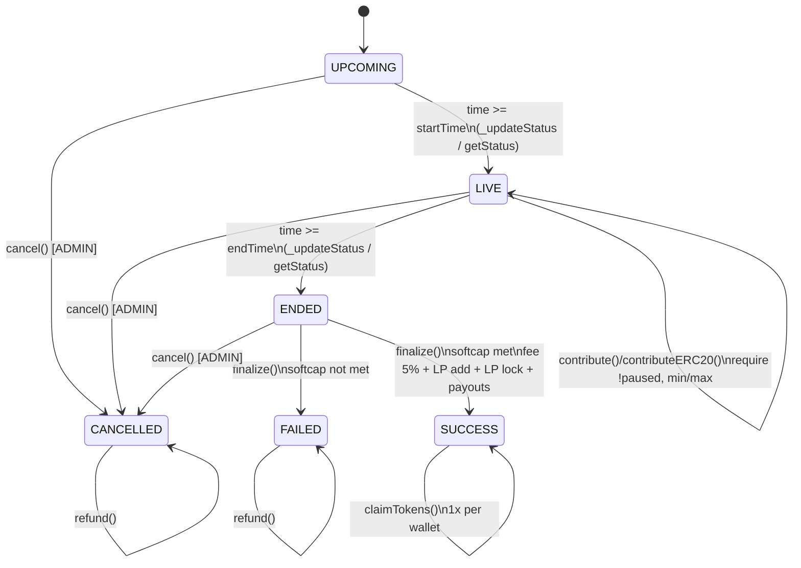

## Fairlaunch E2E Flow Report (UI + API + DB + On-chain)

Tanggal: 2026-02-05  
Scope: mapping dari kode yang ada (tanpa ubah kode / deploy / test).

---

### 1) On-chain state machine (`Fairlaunch.sol` + `FairlaunchFactory.sol`)

**Kontrak**:
- `packages/contracts/contracts/fairlaunch/Fairlaunch.sol`
- `packages/contracts/contracts/fairlaunch/FairlaunchFactory.sol`
- Fee: `packages/contracts/contracts/std-presale/FeeSplitter.sol`

**State (`Fairlaunch.Status`)**:
- `UPCOMING` → sebelum `startTime`
- `LIVE` → selama window sale
- `ENDED` → setelah `endTime`, menunggu `finalize()`
- `SUCCESS` → finalize sukses (softcap met)
- `FAILED` → finalize gagal (softcap tidak met)
- `CANCELLED` → admin cancel (emergency)

**Transisi & rule utama**:
- Time-based update: `_updateStatus()` & `getStatus()` mengubah/mengembalikan `UPCOMING→LIVE→ENDED` berdasarkan `startTime/endTime`.
- Contribute:
  - `contribute()` (native) / `contributeERC20(amount)` (ERC20)
  - require `status == LIVE`, `!isPaused`, min/max per-wallet.
- Finalize: `finalize()` permissionless, require `status == ENDED`, `!isFinalized`.
  - Softcap tidak tercapai → `FAILED`, emit `FinalizedFail()`.
  - Softcap tercapai → hitung `finalTokenPrice`, potong platform fee 5%, tambah liquidity, lock LP, transfer sisa dana ke owner, set `SUCCESS`, emit `FinalizedSuccess(...)`.
- Claim: `claimTokens()` hanya saat `SUCCESS`, pro-rata: `userTokens = contribution * tokensForSale / totalRaised`.
- Refund: `refund()` hanya saat `FAILED || CANCELLED`, kirim balik kontribusi dan zero-out kontribusi user.
- Admin-only (`ADMIN_ROLE`): `setLPLocker`, `pause/unpause`, `cancel`.

**Events**:
`Contributed`, `FinalizedSuccess`, `FinalizedFail`, `TokensClaimed`, `Refunded`, `Paused`, `Unpaused`, `Cancelled`, `LiquidityAdded`.

#### Diagram on-chain (state)



---

### 2) Off-chain flow (submit → approve → deploy → upcoming/live/ended → finalize)

**Submit (user)** — `apps/web/app/api/fairlaunch/submit/route.ts`
- Auth: session atau `x-wallet-address`.
- Validasi params.
- Verifikasi 2 tx on-chain: `escrowTxHash` (to `EscrowVault`) + `creationFeeTxHash` (receipt sukses).
- Insert DB:
  - `projects.status = 'SUBMITTED'`
  - `launch_rounds.status = 'SUBMITTED'`
  - simpan `escrow_tx_hash`, `creation_fee_tx_hash`, `params` (softcap, tokens_for_sale, liquidity_percent, lp_lock_months, dst).

**Admin approve/reject** — `apps/web/app/admin/fairlaunch/review/actions.ts`
- Approve:
  - `projects.status = 'APPROVED'`
  - `launch_rounds.status = 'APPROVED_TO_DEPLOY'` (+ reviewed_by/at)
- Reject:
  - `projects.status = 'REJECTED'`
  - `launch_rounds.status = 'REJECTED'` (+ rejection_reason)

**Admin deploy (Factory)** — `apps/web/app/api/admin/fairlaunch/deploy/route.ts`
- Decode `projectIdBytes32` dari event escrow (`Deposited(...)`).
- Release escrow ke admin wallet (jika masih ada).
- Approve token ke factory (max uint).
- Call `FairlaunchFactory.createFairlaunch(...)` dengan `value = DEPLOYMENT_FEE` (dibaca dari kontrak).
- Extract `FairlaunchCreated` untuk `contractAddress` + `vestingAddress`.
- Update DB:
  - `projects.status = 'DEPLOYED'`, `projects.contract_address = ...`
  - `launch_rounds.status = 'DEPLOYED'`, `launch_rounds.contract_address = ...`

**Upcoming/Live/Ended**
- Worker scheduler: `services/worker/jobs/round-state-scheduler.ts` hanya `APPROVED→LIVE` dan `LIVE→ENDED`.
- UI list: `apps/web/src/lib/data/projects.ts` memakai `calculateRealTimeStatus(round)` (override DB dengan time-based).
- UI detail: `apps/web/app/fairlaunch/[id]/FairlaunchDetail.tsx` tab gating campur timeStatus + DB status strings.

**Finalize**
- Admin server action: `apps/web/src/actions/admin/finalize-fairlaunch.ts`
  - Require DB status `DEPLOYED`.
  - Call on-chain `Fairlaunch.finalize()`.
  - Update DB status ke `'ENDED'` (softcap reached berdasarkan DB `total_raised`) atau `'FAILED'`.

#### Diagram off-chain (UI + API + DB + chain)

```mermaid
flowchart TD
  U[User wallet] -->|escrowTx: deposit token| EV[EscrowVault]
  U -->|creationFeeTx| CH[Chain tx]
  U -->|POST submit| API1[/api/fairlaunch/submit/]
  API1 --> DB[(Supabase)]
  DB -->|projects: SUBMITTED\nlaunch_rounds: SUBMITTED| DB

  A[Admin] -->|approve| ACT[approveFairlaunch()]
  ACT --> DB
  DB -->|launch_rounds: APPROVED_TO_DEPLOY\nprojects: APPROVED| DB

  A -->|POST deploy| API2[/api/admin/fairlaunch/deploy/]
  API2 -->|release escrow + approve factory| EV
  API2 -->|createFairlaunch + DEPLOYMENT_FEE| F[FairlaunchFactory]
  F --> FL[Fairlaunch (deployed)]
  F --> TV[TeamVesting (optional)]
  API2 -->|status DEPLOYED + contract_address| DB

  W[Worker scheduler] -->|APPROVED->LIVE, LIVE->ENDED| DB
  UI[UI list/detail] -->|time-based upcoming/live/ended| DB
  UI -->|contribute/claim/refund tx| FL

  A -->|finalize on-chain| FL
  A -->|update DB status ENDED/FAILED| DB
```

---

### 3) Fees, claim, refund (rules + jalur UI)

**Deployment fee (Factory)**:
- Dibayar saat `createFairlaunch()`; diteruskan ke `treasuryWallet`.

**Creation fee (submit gating)**:
- Submit API hanya memastikan tx sukses dan menyimpan hash + `creation_fee_paid`.

**Platform fee 5% (on-chain)** — `Fairlaunch.finalize()`:
- `platformFee = 5% * totalRaised` → ke `FeeSplitter`.
- `FeeSplitter` default split (share-of-fee): treasury/referral/sbt sesuai `feeConfig` (250/200/50 dari totalBps 500).

**Contribute**:
- UI: `apps/web/app/fairlaunch/[id]/FairlaunchDetail.tsx` (ContributeTab) & hook `apps/web/src/hooks/useFairlaunchContribute.ts`
- Tx: `Fairlaunch.contribute()` (native) lalu record DB via `apps/web/src/actions/fairlaunch/save-contribution.ts` (insert `contributions` status `CONFIRMED`).

**Claim**:
- Precheck/hitung claimable (DB): `apps/web/src/actions/fairlaunch/claim-tokens.ts` (require DB `launch_rounds.status === 'ENDED'`).
- Tx: `claimTokens()` dari `Fairlaunch` di UI detail, lalu mark claimed di DB.

**Refund**:
- UI detail: call langsung `Fairlaunch.refund()` (ethers BrowserProvider).
- Ada endpoint refund request: `apps/web/app/api/rounds/[id]/refund/claim/route.ts` (buat record `refunds`), tapi logic-nya berbasis `launch_rounds.result` + `contributions.user_id`.

---

### 4) Gap / mismatch (dampak + referensi)

1) **`projects.status` set ke nilai yang tidak valid di schema**
- Deploy: set `'DEPLOYED'`; Pause: set `'PAUSED'` (tidak ada di constraint).
- Dampak: update DB bisa gagal / drift.
- File: `apps/web/app/api/admin/fairlaunch/deploy/route.ts`, `apps/web/app/api/admin/fairlaunch/pause/route.ts`, `selsipad_schema.sql`.

2) **Wallet-only auth vs kolom NOT NULL**
- Submit mengizinkan wallet-only tanpa session, tapi insert pakai `owner_user_id`/`created_by` yang bisa undefined.
- Dampak: submit gagal untuk wallet-only.
- File: `apps/web/app/api/fairlaunch/submit/route.ts`, `selsipad_schema.sql`.

3) **Worker scheduler tidak nyambung dengan `APPROVED_TO_DEPLOY/DEPLOYED`**
- Scheduler hanya `APPROVED→LIVE→ENDED`.
- Dampak: fairlaunch DEPLOYED tidak ditransisi oleh worker; UI jadi time-override, DB drift.
- File: `services/worker/jobs/round-state-scheduler.ts`, `apps/web/app/admin/fairlaunch/review/actions.ts`, `apps/web/app/api/admin/fairlaunch/deploy/route.ts`.

4) **DB `ENDED` dipakai untuk “claim-ready”, tapi on-chain claim butuh `SUCCESS`**
- DB check: `claimFairlaunchTokens()` require `round.status === 'ENDED'`.
- Kontrak: `claimTokens()` require `status == SUCCESS`.
- Dampak: UI bisa misleading / tx revert bila on-chain belum SUCCESS.
- File: `apps/web/src/actions/fairlaunch/claim-tokens.ts`, `packages/contracts/contracts/fairlaunch/Fairlaunch.sol`.

5) **Finalize flow ganda + `status/result` drift**
- `finalize-fairlaunch.ts` update `status` saja (`ENDED/FAILED`) dan tidak set `result`.
- `/api/admin/rounds/[id]/finalize` set `status: 'FINALIZED'` (tidak valid di schema) + set `result`.
- Dampak: refund endpoint yang cek `result` bisa tidak jalan; status tidak konsisten.
- File: `apps/web/src/actions/admin/finalize-fairlaunch.ts`, `apps/web/app/api/admin/rounds/[id]/finalize/route.ts`, `selsipad_schema.sql`.

6) **Refund endpoint bergantung pada `result` + `user_id`**
- Refund API cek `round.result in ['FAILED','CANCELED']` dan kontribusi by `user_id`.
- Fairlaunch save-contribution pakai `user_id: null` (wallet-only).
- Dampak: refund request endpoint tidak usable untuk wallet-only fairlaunch; plus `result` sering tidak terset.
- File: `apps/web/app/api/rounds/[id]/refund/claim/route.ts`, `apps/web/src/actions/fairlaunch/save-contribution.ts`.

7) **`CANCELED` vs `CANCELLED`**
- On-chain: `CANCELLED`; schema `result` pakai `CANCELED`; refund API cek `CANCELED`.
- Dampak: cancel/refund condition gampang miss.
- File: `packages/contracts/contracts/fairlaunch/Fairlaunch.sol`, `selsipad_schema.sql`, `apps/web/app/api/rounds/[id]/refund/claim/route.ts`.

8) **Pause off-chain tidak pause on-chain**
- Endpoint pause hanya update DB, tidak call `Fairlaunch.pause()`.
- Dampak: kontribusi masih bisa masuk walau “PAUSED” di UI/DB.
- File: `apps/web/app/api/admin/fairlaunch/pause/route.ts`, `packages/contracts/contracts/fairlaunch/Fairlaunch.sol`.

9) **`lpLocker` harus diset sebelum finalize, tapi flow tidak terlihat menyet**
- `finalize()` selalu memanggil `lpLocker.lockTokens(...)`.
- Dampak: finalize revert jika `lpLocker` belum diset.
- File: `packages/contracts/contracts/fairlaunch/Fairlaunch.sol`, `apps/web/src/actions/admin/finalize-fairlaunch.ts`, `apps/web/app/api/admin/fairlaunch/deploy/route.ts`.

10) **ERC20 fee path belum lengkap**
- `Fairlaunch.finalize()` ERC20 hanya transfer ke `feeSplitter` + catatan.
- Dampak: fee distribusi ERC20 belum jelas/komplet.
- File: `packages/contracts/contracts/fairlaunch/Fairlaunch.sol`, `packages/contracts/contracts/std-presale/FeeSplitter.sol`.

11) **Unit mismatch risiko untuk `liquidity_percent`**
- Deploy route mengalikan `*100` selalu; jika input sudah bps, hasil jadi salah besar.
- Dampak: deploy revert atau tokenomics salah.
- File: `apps/web/app/api/admin/fairlaunch/deploy/route.ts`.

12) **Submit API feeTx belum validasi recipient/amount**
- Hanya cek receipt sukses.
- Dampak: fee gating bisa dibypass (bayar ke address lain).
- File: `apps/web/app/api/fairlaunch/submit/route.ts`.

---

### 6) Pointers cepat (file yang paling sering disentuh)

- On-chain lifecycle: `Fairlaunch.sol`, `FairlaunchFactory.sol`
- Fee split: `FeeSplitter.sol`
- Submit/approve/deploy/finalize: `submit/route.ts`, `review/actions.ts`, `deploy/route.ts`, `finalize-fairlaunch.ts`
- UI contribute/claim/refund: `FairlaunchDetail.tsx`, `useFairlaunchContribute.ts`, `save-contribution.ts`, `claim-tokens.ts`
- Status override: `projects.ts`, `round-state-scheduler.ts`
- DB rules: `selsipad_schema.sql`

