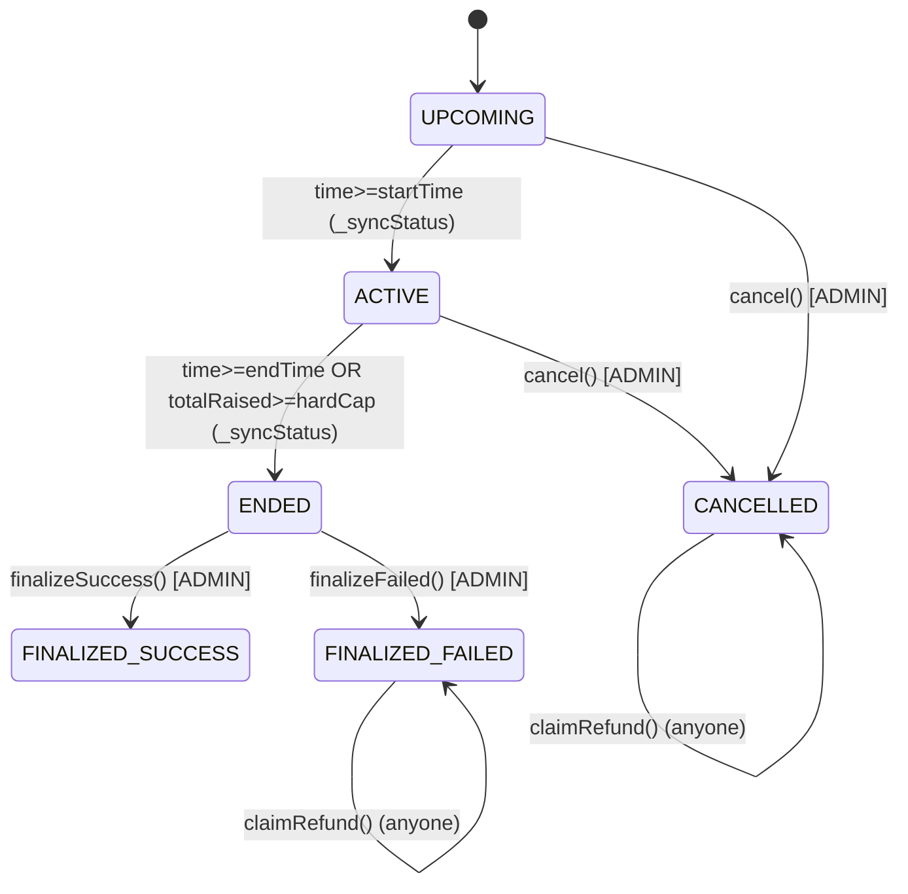

## Presale E2E Flow Report (As-Is vs Spec) — SELSIPAD

Tanggal: 2026-02-05  
Scope: Presale end-to-end (DB + API + UI + Smart Contract) berdasarkan kode & docs di repo.  
Output: mapping “yang seharusnya” (docs) vs “yang berjalan sekarang” (implementasi), plus gap utama & dampaknya.

---

### 0) Baseline requirement (docs/modul)

Sumber baseline:
- `docs/modul/Modul_2_presale.json` (pipeline compliance presale)
- `docs/modul/Modul_6_vesting.json` (vesting wajib, claim server-side)
- `docs/modul/Modul_5_liquidity-lock.json` (LP lock min 12 bulan + success gating)
- `docs/modul/Modul_15_fee-creation.json` (fee 5% + split)
- `docs/ui-ux/presale_ui-ux.json` (state machine UI + flow screen)

**Compliance gates (wajib, blocking submit/deploy)**
- **Dev KYC**: wajib **CONFIRMED**
- **SC Scan**: wajib **PASS** atau **OVERRIDE_PASS**
- **Vesting**: investor + team **wajib** (Modul 6)
- **LP lock plan**: min **12 bulan** (Modul 5)

**Status machine (ideal)**
- Workflow DB: `DRAFT → SUBMITTED_FOR_REVIEW → APPROVED_TO_DEPLOY → DEPLOYING → LIVE → ENDED → FINALIZING → FINALIZED_SUCCESS/FINALIZED_FAIL → REFUNDING → CLOSED`
- UI ideal: membaca status dari **DB/Indexer**, bukan read-chain langsung (read-chain hanya last resort).

---

### 1) Smart Contract (yang sudah ada)

Kontrak presale EVM (implemented + ada tests/scripts):
- `packages/contracts/contracts/std-presale/PresaleRound.sol`
- `packages/contracts/contracts/std-presale/PresaleFactory.sol`
- `packages/contracts/contracts/std-presale/MerkleVesting.sol`
- Fee split: `packages/contracts/contracts/std-presale/FeeSplitter.sol`
- Tests: `packages/contracts/test/std-presale/*` (unit + integration)

#### 1.1 PresaleFactory
- `createPresale(...)` **admin-only** (`FACTORY_ADMIN_ROLE`)
- Deploy 2 kontrak:
  - `MerkleVesting` (scheduleSalt unik)
  - `PresaleRound`
- Grant role:
  - `MerkleVesting.ADMIN_ROLE` diberikan ke `timelockExecutor` dan ke `round` (agar finalize bisa set root)
  - `FeeSplitter.grantPresaleRole(round)` agar round boleh distribute fee
- Record mapping: round → vesting, scheduleSalt, complianceHash, LP plan.

#### 1.2 PresaleRound (on-chain lifecycle)
Enum `Status`: `UPCOMING → ACTIVE → ENDED → FINALIZED_SUCCESS / FINALIZED_FAILED` (+ `CANCELLED`).
- **Contribute**: `contribute(amount, referrer)` (native/ERC20) hanya saat `ACTIVE`, enforce min/max per wallet + hardcap.
- **FinalizeSuccess** (admin-only): `finalizeSuccess(merkleRoot, totalVestingAllocation)`
  - Hitung fee \(5%\) dari `totalRaised`
  - **Fund vesting vault dulu** (transfer project token dari `projectOwner` ke `vestingVault`)
  - `vestingVault.setMerkleRoot(...)` (akan revert kalau vault kurang dana)
  - Distribute fee via `FeeSplitter` (native & ERC20 path ada)
  - Transfer net raised ke `projectOwner`
  - Set `tgeTimestamp = block.timestamp`
  - Set status `FINALIZED_SUCCESS`
- **FinalizeFailed** (admin-only): set `FINALIZED_FAILED` (refund active)
- **Refund safety**: `claimRefund()` hanya butuh status failed/cancelled dan **tidak ter-block oleh pause**.

#### Diagram on-chain (presale)

**Kesimpulan SC**: lifecycle & invariants penting (fee split, vesting funding gate, refund unpausable) **sudah lengkap** di SC.

---

### 2) Database (yang sudah ada)

Sumber DB (repo):
- Migrations: `supabase/migrations/007_fase4_launchpad.sql` (launchpad core)
- Vesting/lock: `supabase/migrations/008_fase5_vesting_lock.sql`
- Presale merkle proofs: `supabase/migrations/20260121193302_presale_merkle_proofs.sql`
- Presale fields extension: `supabase/migrations/20260121193337_launch_rounds_presale_fields.sql`

Tabel penting:
- `launch_rounds` (status/result/params + addresses: `round_address`, `vesting_vault_address`, `merkle_root`, `tge_timestamp`)
- `contributions` (2-step intent/confirm, status `PENDING/CONFIRMED/FAILED/REFUNDED`)
- Trigger: `increment_round_totals` & `decrement_round_totals` update `launch_rounds.total_raised/participants`
- `round_allocations` (hasil finalize off-chain; dipakai untuk vesting allocations)
- `refunds` (tracking request + idempotency)
- `vesting_schedules`, `vesting_allocations`, `vesting_claims`
- `liquidity_locks`
- `round_post_finalize` (orchestration progress)
- `presale_merkle_proofs` (allocation TEXT + proof JSONB)

**Kesimpulan DB**: struktur untuk presale E2E (including vesting/lock/merkle) **sudah tersedia**.

---

### 3) API (yang sudah ada vs masih placeholder)

#### 3.1 CRUD + submit + admin review
Implemented:
- `GET/POST /api/rounds` → `apps/web/app/api/rounds/route.ts`
- `GET/PATCH/DELETE /api/rounds/[id]` → `apps/web/app/api/rounds/[id]/route.ts`
- `POST /api/rounds/[id]/submit` (compliance check) → `apps/web/app/api/rounds/[id]/submit/route.ts`
- `GET /api/admin/rounds` (queue backend) → `apps/web/app/api/admin/rounds/route.ts`
- `POST /api/admin/rounds/[id]/approve` → `apps/web/app/api/admin/rounds/[id]/approve/route.ts`
- `POST /api/admin/rounds/[id]/reject` → `apps/web/app/api/admin/rounds/[id]/reject/route.ts`

Catatan gap:
- Approve endpoint mengharuskan status `SUBMITTED_FOR_REVIEW`, tapi submit endpoint mengubah status ke `SUBMITTED` (bukan `SUBMITTED_FOR_REVIEW`) → status mismatch.

#### 3.2 Contribute intent/confirm
Implemented (DB-only):
- `POST /api/rounds/[id]/contribute/intent`
- `POST /api/rounds/[id]/contribute/confirm`

Gap besar:
- Intent endpoint masih “placeholder”: belum return calldata/instructions, belum verify tx on-chain.
- Ada bug ID: memakai `params.id` dari `PresaleParams` (bukan route param) untuk `round_id` insert/query.

#### 3.3 Refund quote/claim
Implemented:
- `GET /api/rounds/[id]/refund/quote`
- `POST /api/rounds/[id]/refund/claim`

Gap:
- Ini membuat record `refunds` dan meminta user “sign tx” tapi tidak ada tx intent real + tidak ada verifikasi on-chain.

#### 3.4 Finalize (admin) + vesting/lock setup
Implemented:
- `POST /api/admin/rounds/[id]/finalize` (DB-only: set `status=FINALIZED`, set `result`, buat `round_allocations`/`refunds`)
- `POST /api/admin/rounds/[id]/vesting/setup` (buat schedule & allocations DB; TODO tx manager)
- `POST /api/admin/rounds/[id]/lock/setup` + `POST /api/admin/rounds/[id]/lock/confirm` (buat lock record; TODO indexer verify)
- Gates:
  - `GET /api/rounds/[id]/success-gate-status`
  - `POST /api/admin/rounds/[id]/mark-success`

Gap besar:
- Finalize API **tidak memanggil on-chain** `PresaleRound.finalizeSuccess/finalizeFailed`, sehingga:
  - fee split on-chain tidak terjadi
  - transfer net raised ke owner on-chain tidak terjadi
  - vesting vault on-chain tidak difund & merkle root tidak diset
  - refund on-chain (`claimRefund`) tidak enable via SC state (karena SC tidak difinalize)

#### 3.5 Presale helper endpoints (untuk UI claim)
Implemented:
- `GET /api/presale/[id]/contract-address`
- `GET /api/presale/[id]/merkle-proof?wallet=...`

Gap:
- Response shape `merkle-proof` tidak match UI `VestingClaimer` (UI expect `allocation`, API return `totalAllocation`).

---

### 4) UI (yang sudah ada vs belum)

#### 4.1 Pages yang ada
- List: `apps/web/app/presales/page.tsx` + `apps/web/app/presales/PresaleList.tsx`
- Detail: `apps/web/app/presales/[id]/page.tsx` + `apps/web/app/presales/[id]/PresaleDetailClient.tsx`
- Create Wizard: `apps/web/app/create/presale/*`
- Owner dashboard: `apps/web/app/dashboard/owner/presales/*`

#### 4.2 Yang belum ada / belum selesai
- **Admin review UI page**: `/admin/presales/review` tidak ada (docs menyebut ini P0)
- **Owner deploy page**: dashboard mengarah ke `/presales/[id]/deploy`, tapi route tidak ada.
- Detail page:
  - Tab Claim/Refund masih tombol placeholder (tidak wire ke on-chain / API intent).
  - Contribute: ada mismatch props antara `PresaleDetailClient` dan `ContributionForm` (yang satu berbasis `roundId`, yang lain butuh `roundAddress`).

#### 4.3 Web3 hooks/components (existing tapi banyak mismatch)
- Web3 ABI/hooks ada: `apps/web/src/lib/web3/presale-contracts.ts`, `apps/web/src/lib/web3/presale-hooks.ts`
- Namun penggunaan di UI tidak konsisten:
  - `RefundCard.tsx` memanggil `useClaimRefund(roundAddress)` & destructuring `write`, tapi hook mengembalikan `claimRefund(...)` + `hash`.
  - `VestingClaimer.tsx` expect response fields berbeda dengan API.

---

### 5) Matrix “Sudah vs Belum” (high-signal)

| Area | Spec (docs) | DB | API | UI | SC |
|---|---|---:|---:|---:|---:|
| Draft create/update | Wizard + save draft | ⚠️ (ada, tapi rawan duplicate) | ⚠️ (via server actions, tidak via /api/rounds) | ✅ | n/a |
| Compliance gates submit | Blocking KYC+Scan+Vesting+LP lock | ✅ | ⚠️ (submit sets `SUBMITTED`, approve expects `SUBMITTED_FOR_REVIEW`) | ✅ (wizard validation) | n/a |
| Admin review queue | Approve/reject + audit | ✅ | ✅ | ❌ | n/a |
| Deploy on-chain (factory) | Deploy PresaleRound+Vesting | ✅ (fields ada) | ❌ (endpoint deploy tidak ada/ belum wired) | ❌ | ✅ |
| Contribute on-chain | Tx + record | ✅ | ⚠️ (intent/confirm DB-only + bug round_id) | ⚠️ (komponen mismatch) | ✅ |
| Finalize on-chain | finalizeSuccess/fail | ✅ (fields ada) | ❌ (finalize hanya DB) | ❌ | ✅ |
| Merkle root + proofs | server generates + set on-chain | ✅ (table ada) | ⚠️ (proof endpoint ada; generator + root setter belum) | ⚠️ (UI mismatch) | ✅ (MerkleVesting) |
| Claim vesting | claim via vault | ✅ | ⚠️ (intent/confirm DB ada, tapi verifikasi tx TODO) | ⚠️ | ✅ |
| Refund on-chain | claimRefund | ✅ | ⚠️ (refund API only creates record) | ⚠️ | ✅ |
| LP lock | min 12 mo + gating | ✅ | ⚠️ (setup/confirm exists, on-chain verify TODO) | ⚠️ | n/a (locker external) |
| Fee split 5% | on finalize | ✅ (fee_splits table exists per docs, but not in migrations shown) | ❌ | ❌ | ✅ |

Legenda: ✅ implemented, ⚠️ partial/buggy, ❌ missing.

---

### 6) Gap utama + dampak (ringkas)

1) **Finalize masih off-chain (DB-only)**, sementara SC finalize memegang rules fee/vesting/fund safety → **funds/fee/vesting on-chain tidak jalan**.
2) **Deploy on-chain flow tidak ada di UI & API**, padahal SC factory sudah siap → round tidak punya `round_address/vesting_vault_address` terisi secara benar.
3) **Status drift**: `SUBMITTED` vs `SUBMITTED_FOR_REVIEW`, `FINALIZED` vs status lain; UI/endpoint filter pakai status yang tidak konsisten.
4) **UI web3 integration belum rapi** (mismatch props/hook + placeholder claim/refund).
5) **Merkle proof flow belum lengkap**: ada table + endpoint read proof, tapi generator root/proofs + set root on-chain belum jelas di pipeline.

---

### 7) File pointers (untuk implementasi)

- Spec: `docs/modul/Modul_2_presale.json`, `docs/ui-ux/presale_ui-ux.json`
- SC: `packages/contracts/contracts/std-presale/{PresaleRound.sol,PresaleFactory.sol,MerkleVesting.sol,FeeSplitter.sol}`
- DB: `supabase/migrations/{007_fase4_launchpad.sql,008_fase5_vesting_lock.sql,20260121193302_presale_merkle_proofs.sql,20260121193337_launch_rounds_presale_fields.sql}`
- API core: `apps/web/app/api/rounds/**`, `apps/web/app/api/admin/rounds/**`
- UI core: `apps/web/app/presales/**`, `apps/web/app/create/presale/**`, `apps/web/app/dashboard/owner/presales/**`
- Web3 hooks: `apps/web/src/lib/web3/presale-*.ts`

