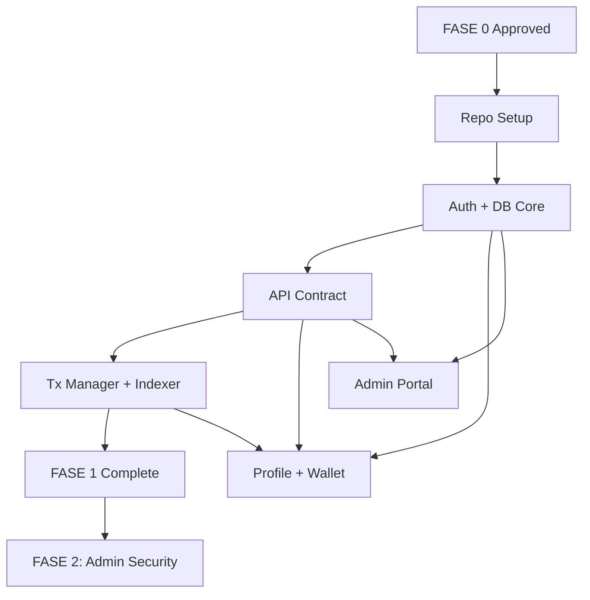

# SELSIPAD FASE 0 - COMPLETE DELIVERABLES
## Scope Lock & Baseline Documentation

**Version:** 1.0  
**Date:** 2026-01-13  
**Status:** READY FOR REVIEW

---

# 0.1 PROJECT CHARTER

## MVP Objective
SELSIPAD adalah platform multi-chain launchpad (EVM & Solana) yang memungkinkan project melakukan token sale dengan aman melalui berbagai mekanisme (Presale, Fairlaunch, Bonding Curve) sambil menjaga keamanan investor dengan liquidity lock wajib, vesting, dan sistem referral/reward yang transparan.

**Target Public Live:** Q1 2026 (Maret 2026)

## Target Users

### 1. Creator/Developer Project
- **Kebutuhan:** Launch token dengan kredibilitas (KYC verified, SC audit), akses fundraising multi-chain
- **Success Metric:** Time to list <7 hari (dari submit hingga LIVE)

### 2. Investor/Participant
- **Kebutuhan:** Transparansi (lock LP visible), refund aman jika fail, vesting claim lancar
- **Success Metric:** 
  - Presale success rate >70%
  - Claim success rate >95%
  - Refund success rate 100%

### 3. Community (Social Feed)
- **Kebutuhan:** Discover trending projects, engage via posting (Blue Check gated)
- **Success Metric:** Engagement rate >30% dari verified users

### 4. Admin Ops/Finance/Reviewer
- **Kebutuhan:** Tools untuk review KYC/scan, manage payout, audit trail lengkap
- **Success Metric:** Audit log 100% compliance, zero unauthorized actions

## KPI Baselines & Targets

| KPI | Baseline (Week 1) | Target (Month 3) |
|-----|------------------|------------------|
| Time to list project | <7 hari | <3 hari |
| Presale success rate | 60% | 75% |
| Claim success rate | 90% | 98% |
| Refund success rate | 100% | 100% |
| % stuck tx (>30 min) | <2% | <0.5% |
| API p95 latency | <800ms | <500ms |
| Trending load time | <500ms | <300ms |

## "Project Live" Definition (Go-Live Criteria)

✅ **Infrastructure:**
- All services healthy (tx_manager, indexer_evm, indexer_sol, workers)
- Monitoring & alerting active
- Backup & recovery tested

✅ **Security:**
- RLS policies verified (deny-by-default)
- Admin MFA enforced
- Two-man rule operational
- No service role keys in client
- Idempotency-Key enforced for critical endpoints

✅ **Functionality:**
- E2E flow tested: Presale SUCCESS → LP Lock → Vesting Claim
- E2E flow tested: Presale FAILED → Refund
- Double-claim protection verified

✅ **Operations:**
- Admin runbook ready
- Support playbook ready
- Incident response SOP documented

---

# 0.2 MVP FEATURE SWITCHBOARD

## Features Status Matrix

| # | Module | Feature | MVP Status | Owner | Staged Rollout | Reason |
|---|--------|---------|-----------|-------|----------------|--------|
| 1 | Mod 8 | Auth + Profile + Multi-wallet | ✅ ON | Backend | Launch Day | Core foundation |
| 2 | Mod 12 | Admin Security (RBAC + MFA + Two-man) | ✅ ON | Backend + DevOps | Launch Day | Security critical |
| 3 | Mod 2 | Presale Pool | ✅ ON | Backend + SC | Launch Day | Core fundraising |
| 4 | Mod 3 | Fairlaunch Pool | ✅ ON | Backend + SC | Launch Day | Core fundraising |
| 5 | Mod 5 | Liquidity Lock (12 bulan min) | ✅ ON | Backend + SC | Launch Day | Anti-rug mechanism |
| 6 | Mod 6 | Vesting System | ✅ ON | Backend + SC | Launch Day | Token distribution |
| 7 | Mod 10 + Patch | Referral + Reward Pool | ✅ ON | Backend | Launch Day | Growth mechanism |
| 8 | Mod 7 | Social Feed + Blue Check + AMA | ✅ ON | Frontend + Backend | Launch Day | Community engagement |
| 9 | Mod 17 | Trending Projects | ✅ ON | Worker + Frontend | Week 2 | Can deploy after feed stable |
| 10 | Mod 4 | Bonding Curve (Solana) | ✅ ON | SC Solana + Backend | **Week 3-4** | Staged: test mature first |
| 11 | Mod 9 | SBT Staking Pool | ✅ ON | Backend + SC | **Week 3-4** | Staged: complex eligibility |
| 12 | Mod 11 | Badge System | ✅ ON | Backend | Launch Day | Simple labels + auto-issue |
| 13 | Mod 1 | Multi-Network (EVM + Solana) | ✅ ON | Backend + SC | Launch Day | Platform core |
| 14 | Mod 13 | Smart Contract Architecture | ✅ ON | SC Team | Pre-launch | Foundation |
| 15 | Mod 14 | API Documentation | ✅ ON | Backend | Launch Day | Developer docs |
| 16 | Mod 15 | Fee & Creation System | ✅ ON | Backend + SC | Launch Day | Revenue model |
| 17 | - | Multi-language UI | ❌ OFF | - | Post-MVP | Complexity vs ROI |
| 18 | - | Advanced Analytics Dashboard | ❌ OFF | - | Month 2+ | MVP cukup basic metrics |
| 19 | - | Complex Moderation Automation | ❌ OFF | - | Post-MVP | Manual moderation cukup |
| 20 | - | Token-gated Content | ❌ OFF | - | Future | Not in scope |

## Staged Rollout Plan

### Launch Day (Week 1)
- Core flows: Presale/Fairlaunch + Lock + Vesting + Refund
- Social: Blue Check purchase + Posting + AMA
- Referral: Pool + Claim (with Patch rules)

### Week 2
- Trending algorithm live (after sufficient feed data)

### Week 3-4
- Bonding Curve Solana (permissionless launch)
- SBT Staking Pool (external NFT verification)

**Rationale Staged:** Bonding & SBT memiliki mechanics lebih kompleks dan lebih aman di-roll out setelah core terbukti stabil.

---

# 0.3 CANONICAL STATUS DICTIONARY

## State Machine Reference

### A. Project Status Flow

```
DRAFT → SUBMITTED → IN_REVIEW → APPROVED → LIVE → ENDED
                                     ↓
                                 REJECTED
```

**Outcome Markers:**
- SUCCESS (after lock + vesting complete)
- FAILED (soft cap tidak tercapai)
- CANCELED (admin/owner cancel)

**Rules:**
- Owner hanya bisa edit saat DRAFT
- Perubahan setelah SUBMITTED butuh resubmission atau admin override
- Status LIVE → ENDED otomatis by scheduler (end_at reached)

---

### B. Launch Round Status (Presale/Fairlaunch)

```
DRAFT → SUBMITTED → APPROVED → LIVE → ENDED → FINALIZED
                        ↓                           ↓
                    REJECTED                   (SUCCESS/FAILED)
```

**Result Values:**
- NONE (belum finalize)
- SUCCESS (raised >= softcap, lock+vesting done)
- FAILED (raised < softcap, refund enabled)
- CANCELED

**Rules:**
- LIVE set otomatis saat `start_at` tercapai (worker)
- ENDED set otomatis saat `end_at` lewat
- FINALIZED hanya bisa dipanggil admin dengan Idempotency-Key
- SUCCESS hanya jika LP LOCKED min 12 bulan + vesting ACTIVE

---

### C. Transaction Status (Tx Manager)

```
CREATED → SUBMITTED → PENDING → CONFIRMED
                           ↓         ↓
                       FAILED    REVERSED (optional)
```

**Triggers:**
- CREATED: saat intent dibuat
- SUBMITTED: tx hash dikirim ke chain
- PENDING: terdeteksi di mempool/pending
- CONFIRMED: mined + sufficient confirmations
- FAILED: tx revert atau timeout
- REVERSED: (opsional) untuk handle reorg

**Rules:**
- Reconcile job: stuck PENDING >15 menit → investigate
- Retry policy: FAILED dengan reason retriable → auto retry max 3x

---

### D. Vesting & Lock Status

#### Vesting Schedule

```
PENDING_SETUP → ACTIVE → CLAIMING (partial) → COMPLETE
```

**Rules:**
- ACTIVE setelah `tge_at` tercapai
- CLAIMING: user sedang claim sebagian (claimable > 0)
- COMPLETE: semua claimed

#### Liquidity Lock

```
PENDING → LOCKED → UNLOCKABLE → UNLOCKED
```

**Rules:**
- LOCKED: on-chain tx confirmed, `lock_end_at` set
- UNLOCKABLE: `now()` >= `lock_end_at`
- UNLOCKED: actual unlock tx confirmed
- **Hard Rule:** min 12 bulan dari lock creation

---

## UI Label Mapping

| Status Code | User-Facing Label | Admin Label | Allowed Actions |
|-------------|------------------|-------------|-----------------|
| DRAFT | "Draf" | "Draft - Editable" | Edit, Submit, Delete |
| SUBMITTED | "Dalam Review" | "Submitted - Needs Review" | View Only (owner), Review (admin) |
| IN_REVIEW | "Sedang Ditinjau" | "In Review" | None (owner), Approve/Reject (admin) |
| APPROVED | "Disetujui" | "Approved - Ready to Schedule" | Schedule Launch (owner/admin) |
| LIVE | "Sedang Berlangsung" | "Live" | Contribute (user), Monitor (admin) |
| ENDED | "Berakhir" | "Ended - Pending Finalize" | None (user), Finalize (admin) |
| FINALIZED - SUCCESS | "Sukses" | "Finalized - Success" | Claim Vesting (user), View Stats (all) |
| FINALIZED - FAILED | "Gagal - Refund Tersedia" | "Finalized - Failed" | Claim Refund (user) |

---

# 0.4 LAUNCH ELIGIBILITY RULES (Truth Table)

## A. Listing Eligibility (Presale/Fairlaunch Creation)

| Kondisi | KYC Status | SC Scan Status | Result | Hard Fail Reason |
|---------|-----------|---------------|--------|------------------|
| 1 | VERIFIED | PASS | ✅ ELIGIBLE | - |
| 2 | VERIFIED | OVERRIDDEN_PASS | ✅ ELIGIBLE | - |
| 3 | VERIFIED | FAIL | ❌ NOT ELIGIBLE | "Smart contract scan failed. Please resubmit after fixes." |
| 4 | VERIFIED | PENDING | ❌ NOT ELIGIBLE | "Smart contract scan is pending review." |
| 5 | PENDING | PASS | ❌ NOT ELIGIBLE | "KYC verification is pending." |
| 6 | PENDING | FAIL | ❌ NOT ELIGIBLE | "KYC pending AND SC scan failed." |
| 7 | REJECTED | ANY | ❌ NOT ELIGIBLE | "KYC verification was rejected. Reason: [rejection_reason]" |
| 8 | ANY | Not Submitted | ❌ NOT ELIGIBLE | "Smart contract scan not submitted." |

**IF/THEN Rules:**
```
IF (kyc_status == VERIFIED) AND (scan_status IN [PASS, OVERRIDDEN_PASS]) 
THEN listing_eligible = TRUE

ELSE 
THEN listing_eligible = FALSE 
AND return specific fail_reason
```

---

## B. Success Finalization Rules (Marking Presale/Fairlaunch as SUCCESS)

| Kondisi | Total Raised | LP Lock Status | Vesting Status | Result | Hard Fail Reason |
|---------|-------------|---------------|----------------|--------|------------------|
| 1 | >= softcap | LOCKED (>=12mo) | ACTIVE (investor+team) | ✅ SUCCESS | - |
| 2 | >= softcap | LOCKED (<12mo) | ACTIVE | ❌ BLOCK | "Liquidity lock must be minimum 12 months. Current: [duration]" |
| 3 | >= softcap | PENDING | ACTIVE | ❌ BLOCK | "Liquidity lock has not been executed yet." |
| 4 | >= softcap | LOCKED (>=12mo) | PENDING_SETUP | ❌ BLOCK | "Team vesting schedule must be active." |
| 5 | < soft cap | ANY | ANY | ❌ MARK FAILED | "Soft cap not reached. Enable refund." |

**IF/THEN Rules:**
```
IF (total_raised >= softcap) THEN:
  IF (lp_lock_status == LOCKED AND lock_duration >= 12_months) THEN:
    IF (team_vesting_status == ACTIVE AND investor_vesting_status == ACTIVE) THEN:
      finalize_result = SUCCESS
    ELSE:
      BLOCK with reason "Vesting not active"
  ELSE:
    BLOCK with reason "LP lock requirement not met"
ELSE:
  finalize_result = FAILED
  enable_refund = TRUE
```

---

## C. Social/Referral Gating Rules

### Posting Feed (Modul 7)

| Kondisi | Blue Check Status | Result | Hard Fail Reason |
|---------|------------------|--------|------------------|
| 1 | ACTIVE or VERIFIED | ✅ CAN POST | - |
| 2 | PENDING | ❌ BLOCKED | "Your Blue Check verification is pending." |
| 3 | None (not purchased) | ❌ BLOCKED | "Blue Check required. Purchase for $10 to unlock posting." |
| 4 | REVOKED | ❌ BLOCKED | "Your Blue Check has been revoked. Contact support." |

**IF/THEN:**
```
IF (bluecheck_status IN [ACTIVE, VERIFIED]) THEN can_post = TRUE
ELSE can_post = FALSE AND return specific_reason
```

---

### Claim Referral Reward (Modul 10 + Patch)

| Kondisi | Blue Check Status | active_referral_count | Payout Wallet | Result | Hard Fail Reason |
|---------|------------------|----------------------|---------------|--------|------------------|
| 1 | ACTIVE/VERIFIED | >= 1 | Set (primary) | ✅ CAN CLAIM | - |
| 2 | ACTIVE/VERIFIED | >= 1 | Not Set | ❌ BLOCKED | "Primary wallet for [chain] not set. Please set wallet first." |
| 3 | ACTIVE/VERIFIED | 0 | Any | ❌ BLOCKED | "No active qualifying referrals. You need at least 1 qualifying referral." |
| 4 | PENDING/None | ANY | ANY | ❌ BLOCKED | "Blue Check required and must be ACTIVE or VERIFIED." |
| 5 | REVOKED | ANY | ANY | ❌ BLOCKED | "Blue Check revoked. Cannot claim rewards." |

**IF/THEN (Patch Rule):**
```
IF (bluecheck_status IN [ACTIVE, VERIFIED]) AND (active_referral_count >= 1) THEN:
  IF (primary_wallet_for_reward_chain IS SET) THEN:
    can_claim_referral = TRUE
  ELSE:
    BLOCK "Primary wallet not set"
ELSE:
  can_claim_referral = FALSE
  return specific_reason (bluecheck or referral_count)
```

**Payout Rule:**
```
ALWAYS payout to user.primary_wallet[reward_chain]
NEVER allow user-specified arbitrary address
```

---

# 0.5 FEE RULEBOOK V1

## Fee Split Matrix

| Event Type | Fee % / Amount | Split Rule | Treasury | Referral Pool | SBT Staking | Notes |
|------------|---------------|-----------|----------|--------------|-------------|-------|
| **Presale Success** | 5% of raised | 3-way split | 50% (2.5%) | 40% (2%) | 10% (0.5%) | Taken from raised funds |
| **Fairlaunch Success** | 5% of raised | 3-way split | 50% (2.5%) | 40% (2%) | 10% (0.5%) | After final_price computation |
| **Bonding Swap** | 1.5% per swap | 50/50 | 50% | 50% | 0% | Per buy/sell transaction |
| **Blue Check Purchase** | $10 flat | 70/30 | 70% ($7) | 30% ($3) | 0% | Lifetime fee |
| **Token Creation Fee** | TBD (e.g., 0.5 SOL or $50) | 100% | 100% | 0% | 0% | Anti-spam measure |
| **SBT Claim Fee** | $10 flat | 100% | 100% | 0% | 0% | Per claim transaction |
| **Bonding Curve Deploy** | 0.5 SOL | 100% | 100% | 0% | 0% | Solana deployment cost |
| **DEX Migration Fee** | 2.5 SOL | 100% | 100% | 0% | 0% | Bonding → Raydium/Orca |

## Detailed Fee Rules

### 1. Presale/Fairlaunch Success Fee (5%)

**Calculation:**
```
success_fee = total_raised * 0.05
treasury_share = success_fee * 0.50  // 2.5% of total raised
referral_share = success_fee * 0.40  // 2.0% of total raised
sbt_share = success_fee * 0.10       // 0.5% of total raised
```

**Execution Point:** During `finalize_round` (admin action, Idempotency-Key required)

**Ledger Entries:**
- 3 separate entries ke buckets: TREASURY, REFERRAL_POOL, SBT_STAKING
- Idempotent per `round_id` (replay safe)

---

### 2. Bonding Swap Fee (1.5%)

**Calculation:**
```
swap_fee = amount_in * 0.015
treasury_share = swap_fee * 0.50
referral_share = swap_fee * 0.50
```

**Execution Point:** Per swap confirm event (indexer writes ledger)

**Target Recipient:**
- Jika swapper punya referrer ACTIVE → 50% ke referrer langsung
- Jika tidak → masuk global referral pool

---

### 3. Blue Check Fee ($10)

**Split:**
```
treasury = $10 * 0.70 = $7
referral_pool = $10 * 0.30 = $3
```

**Payment Flow:**
1. User pays $10 (stablecoin/native)
2. Tx Manager verifies payment
3. Set `bluecheck_status = ACTIVE`
4. Ledger split 70/30

---

## Fee Change Policy

**Rule:** Perubahan fee rules wajib melalui **Two-Man Rule** + Audit Log

**Procedure:**
1. Admin A request change via `POST /v1/admin/fee-rules/request-change`
2. Admin B (different person) approve via `POST /v1/admin/fee-rules/:id/approve`
3. Audit log mencatat: requester, approver, old_value, new_value, reason, timestamp

**Lock Period:** Fee yang sudah di-set untuk round yang LIVE tidak boleh diubah retroaktif

---

# 0.6 NFR & SLO V1 (Non-Functional Requirements & Service Level Objectives)

## Performance Requirements

| Metric | Target (p95) | Critical Threshold | Action if Breach |
|--------|-------------|-------------------|------------------|
| Trending endpoint | <300ms | >500ms | Scale worker, add cache layer |
| Feed list API | <500ms | >1000ms | Optimize query, add indexes |
| Contribute confirm | <2s | >5s | Check Tx Manager queue |
| Claim payout | <3s | >10s | Alert ops team |
| Admin dashboard load | <800ms | >1500ms | Optimize queries |

## Security Requirements (P0)

### 1. RLS (Row Level Security)
- **Rule:** Deny-by-default untuk semua tabel sensitif
- **Enforcement:** Server-side policies + client tidak pernah dapat service role key
- **Audit:** Monthly RLS audit (sample query attempts)

### 2. Idempotency
- **Scope:** 
  - Finalize round
  - Claim vesting/referral/SBT reward
  - Execute LP lock
  - Refund
  - Payout
- **Implementation:** `Idempotency-Key` header (UUID), store di DB `idempotency_log`, TTL 24 jam

### 3. Endpoint Security
| Endpoint Pattern | Rate Limit | Auth Required | Idempotency | RLS |
|-----------------|-----------|--------------|-------------|-----|
| `/v1/auth/*` | 10 req/min/IP | No | No | N/A |
| `/v1/projects` | 100 req/min/user | Yes | No (GET), Yes (POST) | Yes |
| `/v1/rounds/*/contribute/confirm` | 5 req/min/user | Yes | **Yes** | Yes |
| `/v1/claim/*` | 3 req/min/user | Yes | **Yes** | Yes |
| `/v1/admin/*` | 30 req/min/admin | Yes (MFA) | Varies | Yes (admin-only policies) |

### 4. UI Read-Only from DB
- **Rule:** Client tidak boleh langsung query chain untuk data finansial
- **Rationale:** Prevent race conditions, ensure single source of truth
- **Exception:** Real-time price chart (optional, non-critical)

## Incident Response Policy

### Severity Levels

| Level | Definition | Response Time | Escalation |
|-------|-----------|--------------|------------|
| S1 | Dana berisiko, exploit aktif | <15 min | Immediate war room |
| S2 | Fitur dana down (contribute/claim/refund) | <30 min | On-call tech lead |
| S3 | Bug minor, UI glitch | <2 hours | Regular backlog |

### Pause Mechanisms (Kill Switches)

**Available Toggles (server-side feature flags):**
- Disable contribute (global or per-round)
- Disable finalize (admin only)
- Disable claims (vesting/referral/SBT)
- Disable posting feed
- Disable AMA join token issuance

**Access Control:** Super Admin + Ops role (dengan audit log)

**Guarantee:** Toggle tidak merusak hak user yang sudah ada (contoh: refund rightful users tetap bisa)

---

# 0.7 RELEASE GATE & QA STRATEGY

## Go/No-Go Checklist (Must Pass BEFORE Production Deployment)

### Infrastructure (Pre-Deploy)
- [ ] All services health-check GREEN (tx_manager, indexer, workers)
- [ ] DB migration tested in staging
- [ ] Secrets rotated for production (JWT, encryption keys, RPC keys)
- [ ] Backup & restore tested (point-in-time available)
- [ ] DNS & SSL configured (HSTS enabled for prod)

### Security (Pre-Deploy)
- [ ] RLS policies verified (deny-by-default for sensitive tables)
- [ ] No service role key in client bundle (linter check pass)
- [ ] Admin MFA enforced (100% of admin accounts)
- [ ] Two-man rule operational (smoke test 1 critical action)
- [ ] Idempotency-Key enforced for all critical endpoints
- [ ] Rate limiting active (auth, post, claim)
- [ ] Wallet signature nonce replay protection verified

### Functional E2E Tests (Must Pass in Staging)

#### E2E-01: Presale SUCCESS → Lock → Vesting → Claim
1. User creates project → submits
2. Admin approves (KYC VERIFIED, Scan PASS)
3. User creates presale round → submits
4. Admin approves → round goes LIVE
5. 3 users contribute (total >= softcap)
6. Round ENDS → Admin finalizes SUCCESS
7. **Gate Check:** LP lock min 12 months executed → status LOCKED
8. **Gate Check:** Investor vesting ACTIVE + Team vesting ACTIVE
9. User claims vesting (TGE portion) → payout confirmed to primary wallet

**Expected:**
- [ ] No double credit contribution
- [ ] LP lock duration >= 12 months enforced
- [ ] Vesting claim goes to correct primary wallet
- [ ] Finalize idempotent (replay doesn't double allocate)

---

#### E2E-02: Presale FAILED → Refund
1. Presale raised < softcap
2. Round ends → Admin finalizes FAILED
3. Users claim refund

**Expected:**
- [ ] Refund only once per user (unique constraint)
- [ ] Refund blocked if primary wallet not set (with clear reason)
- [ ] Refund tx confirmed and visible in UI from DB

---

#### E2E-03: Fairlaunch SUCCESS → Allocation → Lock
1. Fairlaunch receives contributions from multiple users
2. Finalize SUCCESS → `final_price = total_raised / token_for_sale`
3. Allocation computed per user
4. LP lock >=12 months + vesting active

**Expected:**
- [ ] `final_price` calculation accurate
- [ ] Total allocated tokens ≈ `token_for_sale` (within rounding)
- [ ] 70% funds to liquidity verified
- [ ] Success gates PASSED only after lock+vesting

---

#### E2E-04: Blue Check → Posting → Referral Claim (Patch)
1. User A becomes referrer (1 qualifying referee)
2. User A purchases Blue Check → status ACTIVE
3. User A posts successfully
4. User A claims referral reward → SUCCESS
5. User B has Blue Check but `active_referral_count=0` → claim BLOCKED

**Expected:**
- [ ] Non-BlueCheck cannot post (RLS + server validation)
- [ ] Referral claim enforces Patch rule (BlueCheck + count>=1)
- [ ] Hard fail reasons displayed in UI

---

#### E2E-05: Double-Claim Protection (Vesting, Referral, SBT)
1. Attempt to claim vesting twice with same Idempotency-Key → second call returns cached result
2. Attempt to claim without Idempotency-Key twice → error on second attempt
3. Ledger locking prevents race condition

**Expected:**
- [ ] Idempotency middleware works
- [ ] Database constraints (unique per user/round/type) enforced
- [ ] Audit log shows only 1 successful claim

---

#### E2E-06: Admin Two-Man Rule
1. Admin A requests to override scan status to OVERRIDDEN_PASS
2. Admin A tries to approve own request → DENIED
3. Admin B approves → action executed
4. Audit log shows both actors

**Expected:**
- [ ] Requester cannot approve own action
- [ ] Both admin IDs recorded in audit
- [ ] Action executes exactly once

---

### Performance & Load (Pre-Deploy)
- [ ] Load test: 200 req/min to `/v1/trending` → p95 < 300ms
- [ ] Load test: 100 users contribute simultaneously → no stuck tx >1 min
- [ ] Indexer catchup test: restart service → catches up within 5 min

### Data Integrity (Pre-Deploy)
- [ ] Reconcile job: round totals match sum of contributions CONFIRMED
- [ ] Reconcile job: ledger totals match fee_events source
- [ ] Trending snapshot generated every 10 minutes
- [ ] No negative balances in ledger (anomaly detector alert)

---

## QA Test Plan Summary

### Unit Tests (Required Coverage: >70% for core logic)
- Vesting claimable calculator (cliff, interval, rounding)
- Fairlaunch `final_price` + allocation formula
- Fee split writer (multiple split configurations)
- Eligibility checker (KYC/scan/lock/vesting gates)
- Idempotency handler (same key → same result)

### Integration Tests
- Tx Manager: submit → confirm → DB update
- Indexer replay: same event → no duplicate insert
- RLS: User A cannot read User B's sensitive data

### E2E Tests (as listed above)
- All 6 critical flows must PASS

---

# 0.8 RACI & TIMELINE SPRINT

## RACI Matrix

| Role | Responsibilities | Accountable | Consulted | Informed |
|------|-----------------|-------------|-----------|----------|
| **Product Owner (PO)** | Scope decisions, acceptance criteria, user stories | Feature prioritization | All teams | Stakeholders |
| **Tech Lead** | Architecture, code standards, security review sign-off | Technical decisions | DevOps, Backend, Frontend | PO |
| **Backend Engineer** | API, Tx Manager, indexer, workers, smart contract integration | Backend implementation | SC Team, Frontend | Tech Lead |
| **Frontend Engineer** | Web UI, Admin UI, wallet integration | UI/UX implementation | Backend, Designer | PO |
| **Smart Contract Engineer** | EVM contracts, Solana programs, audits | On-chain logic | Backend, Security | Tech Lead |
| **DevOps Engineer** | Infrastructure, CI/CD, monitoring, secrets management | Deployment & uptime | Backend, Tech Lead | All teams |
| **QA Engineer** | Test plans, E2E execution, bug triage | Quality gates | Backend, Frontend | PO, Tech Lead |
| **Security Reviewer** | P0 checklist, RLS audit, incident response | Security sign-off | Tech Lead, DevOps | PO |

---

## Timeline: FASE 1 Sprint (High-Level)

**Duration:** 2-3 weeks  
**Start:** Post FASE 0 approval  
**Deliverables:** Repo + Auth + DB Core + API Contract + Tx Manager skeleton

### Week 1: Infrastructure Foundation
| Day | Task | Owner | Deliverable |
|-----|------|-------|-------------|
| 1-2 | Monorepo setup (Turborepo + pnpm) | DevOps + Backend | CI/CD running, lint/test passing |
| 3 | Supabase project + Auth setup | Backend | JWT auth working |
| 4 | DB schema core tables + migrations | Backend | RLS baseline deny-by-default |
| 5 | API contract v1 (error/pagination/idempotency) | Backend | Swagger docs v1 |

### Week 2: Core Services
| Day | Task | Owner | Deliverable |
|-----|------|-------|-------------|
| 6-7 | Chain adapter (EVM + Solana) | Backend | Interface defined, 1 dummy tx works |
| 8-9 | Tx Manager service (submit/track/reconcile) | Backend | Service running, status flow works |
| 10 | Indexer skeleton (event ingestion) | Backend | 1 event → DB update end-to-end |

### Week 3: UI & Integration
| Day | Task | Owner | Deliverable |
|-----|------|-------|-------------|
| 11-12 | Profile UI + wallet linking | Frontend + Backend | Link wallet flow complete |
| 13 | Admin portal + MFA scaffold | Frontend + Backend | Admin login with MFA works |
| 14 | Smoke test E2E | QA | Dummy tx confirmed → UI updated |
| 15 | Retrospective + FASE 2 kickoff | All | Lessons learned, blockers identified |

---

## Dependencies & Critical Path



**Critical Path:** Repo → Auth/DB → API → Tx Manager → Profile Integration

---

## Risk Register (Top 5 FASE 1 Risks)

| Risk | Probability | Impact | Mitigation |
|------|-----------|--------|------------|
| Indexer delay on Solana (RPC rate limits) | Medium | High | Use paid RPC, implement retry with backoff |
| RLS policies too restrictive (blocks legit queries) | Medium | Medium | Test early with integration tests |
| Tx Manager stuck tx handling incomplete | Low | High | Build reconcile job from day 1 |
| Multi-wallet UX confusing | High | Low | Early user testing, clear UI copy |
| Secret management misconfigured | Low | Critical | Checklist review by security + DevOps |

---

## Communication Plan

| Frequency | Meeting | Participants | Purpose |
|-----------|---------|--------------|---------|
| Daily | Standup (15 min) | Tech Lead, Backend, Frontend, DevOps | Blockers, progress |
| Weekly | Demo + Planning | All + PO | Sprint review, next week plan |
| Bi-weekly | Security Review | Tech Lead, Security, DevOps | P0 checklist review |
| As-needed | War Room | Ops, Backend, Tech Lead | Incident response |

---

# CONCLUSION & SIGN-OFF

## FASE 0 Deliverables Summary

✅ **0.1 Project Charter** - MVP objectives, users, KPIs defined  
✅ **0.2 Feature Switchboard** - ON/OFF matrix with staged rollout plan  
✅ **0.3 Status Dictionary** - Canonical state machines for all flows  
✅ **0.4 Eligibility Rules** - Truth tables for listing, success, and claims  
✅ **0.5 Fee Rulebook** - All fee splits locked with change policy  
✅ **0.6 NFR & SLO** - Performance, security, incident response defined  
✅ **0.7 QA Strategy** - Go/No-Go checklist + E2E test plan  
✅ **0.8 RACI & Timeline** - Roles and FASE 1 sprint plan  

## Next Steps

1. **Review & Approval:** Product Owner + Tech Lead sign off on all 8 deliverables
2. **Team Briefing:** Share docs with all team members, Q&A session
3. **Kickoff FASE 1:** Execute repo setup + foundation sprint (2-3 weeks)

## Sign-Off

| Role | Name | Signature | Date |
|------|------|-----------|------|
| Product Owner | _______________ | _______________ | 2026-01-13 |
| Tech Lead | _______________ | _______________ | 2026-01-13 |
| Security Lead | _______________ | _______________ | 2026-01-13 |
| DevOps Lead | _______________ | _______________ | 2026-01-13 |

---

**Document Control:**  
- **Version:** 1.0  
- **Status:** READY FOR APPROVAL  
- **Next Review:** Post FASE 1 (for refinements based on learnings)

**END OF FASE 0 DELIVERABLES**
