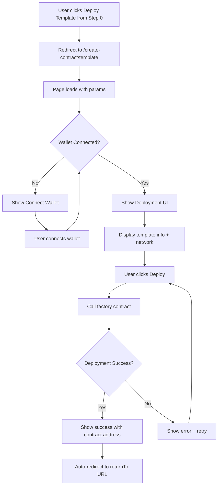

# Implementation Plan: Template Contract Deployment Page

## Overview

Create a dedicated page for deploying presale contracts from audited templates via factory contract. This page allows developers to deploy a pre-audited smart contract template without manual deployment, then return to the presale wizard to complete setup.

---

## Page Location

**Route**: `/apps/web/app/create-contract/template/page.tsx`

**URL Pattern**: `/create-contract/template?version={version}&network={network}&returnTo={returnPath}`

**Query Params**:

- `version`: Template version (e.g., "1.0.0")
- `network`: Target network (e.g., "bsc", "ethereum", "polygon")
- `returnTo`: Redirect URL after deployment (e.g., "/create/presale")

---

## User Flow



---

## Page Structure

### 1. Layout & Header

```tsx
export default function TemplateDeploymentPage() {
  const searchParams = useSearchParams();
  const version = searchParams.get('version') || '1.0.0';
  const network = searchParams.get('network') || 'bsc';
  const returnTo = searchParams.get('returnTo') || '/create/presale';

  return (
    <div className="min-h-screen bg-gray-950 py-8">
      <div className="container mx-auto px-4 max-w-3xl">
        {/* Header */}
        <div className="mb-8">
          <h1 className="text-3xl font-bold text-white mb-2">Deploy Template Contract</h1>
          <p className="text-gray-400">
            Deploy your presale contract from our audited template on {network}
          </p>
        </div>

        {/* Main Content */}
        <DeploymentFlow version={version} network={network} returnTo={returnTo} />
      </div>
    </div>
  );
}
```

### 2. Deployment Flow Component

```tsx
function DeploymentFlow({ version, network, returnTo }: Props) {
  const [step, setStep] = useState<'connect' | 'review' | 'deploying' | 'success' | 'error'>(
    'connect'
  );
  const [deployedAddress, setDeployedAddress] = useState<string | null>(null);
  const [txHash, setTxHash] = useState<string | null>(null);
  const [error, setError] = useState<string | null>(null);

  // Wallet connection
  const { address, isConnected } = useWalletConnection();

  useEffect(() => {
    if (isConnected) {
      setStep('review');
    }
  }, [isConnected]);

  const handleDeploy = async () => {
    setStep('deploying');
    try {
      const result = await deployFromFactory({
        templateVersion: version,
        network,
        deployer: address,
      });

      setDeployedAddress(result.contractAddress);
      setTxHash(result.txHash);
      setStep('success');

      // Auto-redirect after 3 seconds
      setTimeout(() => {
        window.location.href = `${returnTo}?contractAddress=${result.contractAddress}`;
      }, 3000);
    } catch (err) {
      setError(err.message);
      setStep('error');
    }
  };

  return (
    <>
      {step === 'connect' && <ConnectWalletStep />}
      {step === 'review' && <ReviewStep onDeploy={handleDeploy} />}
      {step === 'deploying' && <DeployingStep />}
      {step === 'success' && <SuccessStep address={deployedAddress} txHash={txHash} />}
      {step === 'error' && <ErrorStep error={error} onRetry={() => setStep('review')} />}
    </>
  );
}
```

---

## Component Details

### ConnectWalletStep

```tsx
function ConnectWalletStep() {
  return (
    <div className="bg-gray-900 border border-gray-800 rounded-xl p-8 text-center">
      <Shield className="w-16 h-16 text-purple-500 mx-auto mb-4" />
      <h2 className="text-2xl font-bold text-white mb-2">Connect Your Wallet</h2>
      <p className="text-gray-400 mb-6">Connect your wallet to deploy the template contract</p>
      <ConnectWalletButton />
    </div>
  );
}
```

### ReviewStep

```tsx
function ReviewStep({ onDeploy, version, network }) {
  return (
    <div className="space-y-6">
      {/* Template Info Card */}
      <div className="bg-gray-900 border border-gray-800 rounded-xl p-6">
        <h3 className="text-lg font-semibold text-white mb-4">Template Details</h3>
        <div className="space-y-3">
          <div className="flex justify-between">
            <span className="text-gray-400">Version</span>
            <code className="text-white font-mono">{version}</code>
          </div>
          <div className="flex justify-between">
            <span className="text-gray-400">Network</span>
            <span className="text-white">{network}</span>
          </div>
          <div className="flex justify-between">
            <span className="text-gray-400">Deployment Method</span>
            <span className="text-white">Factory Contract</span>
          </div>
          <div className="flex justify-between">
            <span className="text-gray-400">Estimated Gas</span>
            <span className="text-white">~0.02 BNB</span>
          </div>
        </div>
      </div>

      {/* Security Notice */}
      <div className="bg-green-950/30 border border-green-800 rounded-lg p-4">
        <div className="flex gap-3">
          <CheckCircle className="w-5 h-5 text-green-400 flex-shrink-0" />
          <div className="text-sm text-green-300">
            <strong>Audited Template</strong>
            <p className="text-green-200/80 mt-1">
              This template has been professionally audited and is safe to deploy.
            </p>
          </div>
        </div>
      </div>

      {/* Deploy Button */}
      <button
        onClick={onDeploy}
        className="w-full py-4 bg-gradient-to-r from-purple-600 to-blue-600 hover:from-purple-700 hover:to-blue-700 text-white rounded-lg font-semibold text-lg transition-colors"
      >
        Deploy Contract
      </button>
    </div>
  );
}
```

### DeployingStep

```tsx
function DeployingStep() {
  return (
    <div className="bg-gray-900 border border-gray-800 rounded-xl p-8 text-center">
      <Loader2 className="w-16 h-16 text-blue-500 mx-auto mb-4 animate-spin" />
      <h2 className="text-2xl font-bold text-white mb-2">Deploying Contract...</h2>
      <p className="text-gray-400 mb-4">Please wait while your contract is being deployed</p>
      <div className="space-y-2 text-sm text-gray-500">
        <p>✓ Preparing deployment transaction</p>
        <p>⏳ Waiting for confirmation...</p>
        <p className="text-gray-600">This may take 1-2 minutes</p>
      </div>
    </div>
  );
}
```

### SuccessStep

```tsx
function SuccessStep({ address, txHash, returnTo }) {
  return (
    <div className="bg-gray-900 border border-gray-800 rounded-xl p-8 text-center">
      <CheckCircle className="w-16 h-16 text-green-500 mx-auto mb-4" />
      <h2 className="text-2xl font-bold text-white mb-2">Contract Deployed! 🎉</h2>
      <p className="text-gray-400 mb-6">Your presale contract has been successfully deployed</p>

      {/* Contract Address */}
      <div className="bg-gray-800 rounded-lg p-4 mb-6">
        <p className="text-sm text-gray-400 mb-2">Contract Address</p>
        <div className="flex items-center justify-between gap-2">
          <code className="text-green-400 font-mono text-sm">{address}</code>
          <button
            onClick={() => navigator.clipboard.writeText(address)}
            className="text-gray-400 hover:text-white"
          >
            <Copy className="w-4 h-4" />
          </button>
        </div>
      </div>

      {/* Transaction Hash */}
      <a
        href={`https://bscscan.com/tx/${txHash}`}
        target="_blank"
        rel="noopener noreferrer"
        className="text-blue-400 hover:text-blue-300 text-sm flex items-center justify-center gap-2"
      >
        View on Explorer
        <ExternalLink className="w-4 h-4" />
      </a>

      {/* Auto-redirect notice */}
      <p className="text-sm text-gray-500 mt-6">Redirecting to presale setup in 3 seconds...</p>
    </div>
  );
}
```

### ErrorStep

```tsx
function ErrorStep({ error, onRetry }) {
  return (
    <div className="bg-gray-900 border border-gray-800 rounded-xl p-8 text-center">
      <AlertTriangle className="w-16 h-16 text-red-500 mx-auto mb-4" />
      <h2 className="text-2xl font-bold text-white mb-2">Deployment Failed</h2>
      <p className="text-gray-400 mb-4">There was an error deploying your contract</p>

      {/* Error Details */}
      <div className="bg-red-950/30 border border-red-800 rounded-lg p-4 mb-6 text-left">
        <p className="text-red-400 text-sm font-mono">{error}</p>
      </div>

      {/* Retry Button */}
      <button
        onClick={onRetry}
        className="w-full py-3 bg-gray-800 hover:bg-gray-700 text-white rounded-lg font-medium transition-colors"
      >
        Try Again
      </button>
    </div>
  );
}
```

---

## Backend Integration

### Factory Contract Interface

```typescript
// apps/web/app/create-contract/template/actions.ts

export async function deployFromFactory({
  templateVersion,
  network,
  deployer,
}: {
  templateVersion: string;
  network: string;
  deployer: string;
}): Promise<{ contractAddress: string; txHash: string }> {
  // 1. Get factory contract address for network
  const factoryAddress = getFactoryAddress(network);

  // 2. Prepare deployment parameters
  const params = {
    version: templateVersion,
    deployer,
    // Additional template params
  };

  // 3. Call factory contract
  const tx = await factoryContract.deployTemplate(params);

  // 4. Wait for confirmation
  const receipt = await tx.wait();

  // 5. Extract deployed contract address from event
  const deployedAddress = receipt.events.find((e) => e.event === 'TemplateDeployed').args
    .contractAddress;

  // 6. Save deployment record to database
  await saveDeployment({
    templateVersion,
    network,
    contractAddress: deployedAddress,
    deployer,
    txHash: receipt.transactionHash,
    status: 'SUCCESS',
  });

  return {
    contractAddress: deployedAddress,
    txHash: receipt.transactionHash,
  };
}
```

### Database Schema

```sql
-- contracts_deployed table
CREATE TABLE contracts_deployed (
  id UUID PRIMARY KEY DEFAULT gen_random_uuid(),
  user_id UUID NOT NULL REFERENCES auth.users(id),
  template_version TEXT NOT NULL,
  network TEXT NOT NULL,
  contract_address TEXT NOT NULL,
  deployer_address TEXT NOT NULL,
  tx_hash TEXT NOT NULL,
  deployment_status TEXT NOT NULL CHECK (deployment_status IN ('PENDING', 'SUCCESS', 'FAILED')),
  deployed_at TIMESTAMPTZ DEFAULT NOW(),
  created_at TIMESTAMPTZ DEFAULT NOW()
);

CREATE INDEX idx_contracts_deployed_user ON contracts_deployed(user_id);
CREATE INDEX idx_contracts_deployed_address ON contracts_deployed(contract_address);
```

---

## Return Flow

After successful deployment, redirect back to presale wizard with deployed contract address:

```typescript
// In SuccessStep
setTimeout(() => {
  const params = new URLSearchParams({
    contractAddress: deployedAddress,
    deploymentTx: txHash,
  });
  window.location.href = `${returnTo}?${params.toString()}`;
}, 3000);
```

**Presale Wizard Should Handle**:

```typescript
// In CreatePresaleWizard
useEffect(() => {
  const params = new URLSearchParams(window.location.search);
  const contractAddress = params.get('contractAddress');

  if (contractAddress) {
    // Set contract data from deployment
    setWizardData((prev) => ({
      ...prev,
      contract_mode: 'LAUNCHPAD_TEMPLATE',
      contract_address: contractAddress,
      template_deployment_tx: params.get('deploymentTx'),
    }));

    // Clear URL params
    window.history.replaceState({}, '', '/create/presale');
  }
}, []);
```

---

## Error Handling

### Common Errors

1. **User Rejects Transaction**

   ```
   Error: User denied transaction signature
   → Show friendly message + retry button
   ```

2. **Insufficient Gas**

   ```
   Error: Insufficient funds for gas
   → Show required amount + link to buy
   ```

3. **Network Mismatch**

   ```
   Error: Wrong network selected
   → Prompt user to switch network
   ```

4. **Factory Contract Error**
   ```
   Error: Template deployment failed
   → Show technical error + contact support
   ```

---

## Testing Checklist

### Pre-Deployment Tests

- [ ] Page loads with correct query params
- [ ] Wallet connection works for all supported wallets
- [ ] Template info displays correctly
- [ ] Gas estimation shows accurate estimate

### Deployment Tests

- [ ] Factory contract call succeeds
- [ ] Transaction confirmation detected
- [ ] Deployed contract address extracted correctly
- [ ] Database record created

### Post-Deployment Tests

- [ ] Success page shows correct contract address
- [ ] Blockchain explorer link works
- [ ] Auto-redirect to presale wizard works
- [ ] Presale wizard receives contract address correctly

### Error Tests

- [ ] User rejection handled gracefully
- [ ] Insufficient gas error shows helpful message
- [ ] Network mismatch prompts network switch
- [ ] Failed deployment allows retry

---

## Dependencies

### Required Before Implementation

1. **Factory Smart Contract**
   - Deployed on target networks (BSC, ETH, Polygon, etc.)
   - Template deployment function
   - Event emission for deployed address

2. **Wallet Integration**
   - Multi-chain wallet connection (already exists)
   - Contract interaction utilities

3. **Database Migration**
   - `contracts_deployed` table

4. **Template Audit Status API**
   - Endpoint to check if template version is audited

---

## File Structure

```
apps/web/app/create-contract/template/
├── page.tsx                    # Main page
├── actions.ts                  # Server actions for deployment
└── components/
    ├── DeploymentFlow.tsx      # Main flow orchestrator
    ├── ConnectWalletStep.tsx   # Wallet connection
    ├── ReviewStep.tsx          # Review deployment
    ├── DeployingStep.tsx       # Loading state
    ├── SuccessStep.tsx         # Success state
    └── ErrorStep.tsx           # Error handling
```

---

## Implementation Priority

### Phase 1: Basic Structure

- [ ] Create page route
- [ ] Wallet connection
- [ ] Template info display

### Phase 2: Factory Integration

- [ ] Factory contract integration
- [ ] Deployment transaction
- [ ] Transaction confirmation

### Phase 3: Polish

- [ ] Error handling
- [ ] Loading states
- [ ] Success animations
- [ ] Auto-redirect

### Phase 4: Testing

- [ ] End-to-end tests
- [ ] Error scenario tests
- [ ] Multi-network tests

---

## Notes for Future Implementation

- Ensure factory contract is deployed and verified on all networks before implementing
- Consider adding "Simulate Deployment" button for testing without gas costs
- Add analytics tracking for deployment success/failure rates
- Consider caching template info to reduce API calls
- Add WebSocket support for real-time deployment status updates

---

## Estimated Timeline

- **Phase 1**: 2-3 days
- **Phase 2**: 3-4 days (depends on factory contract)
- **Phase 3**: 1-2 days
- **Phase 4**: 2-3 days

**Total**: ~1.5-2 weeks after factory contract is ready
